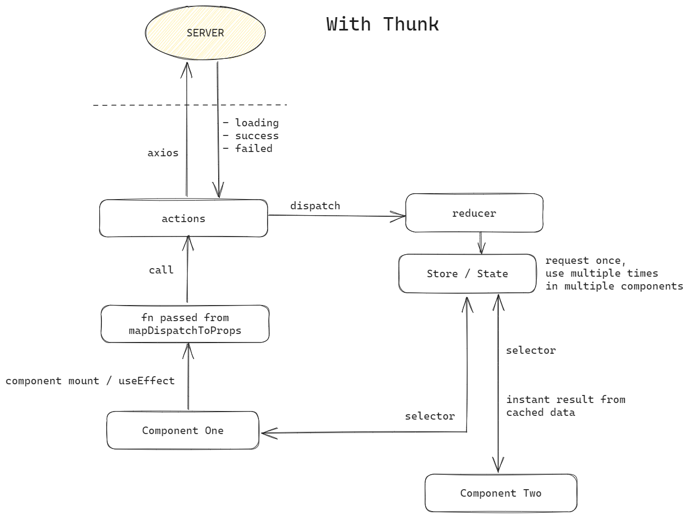
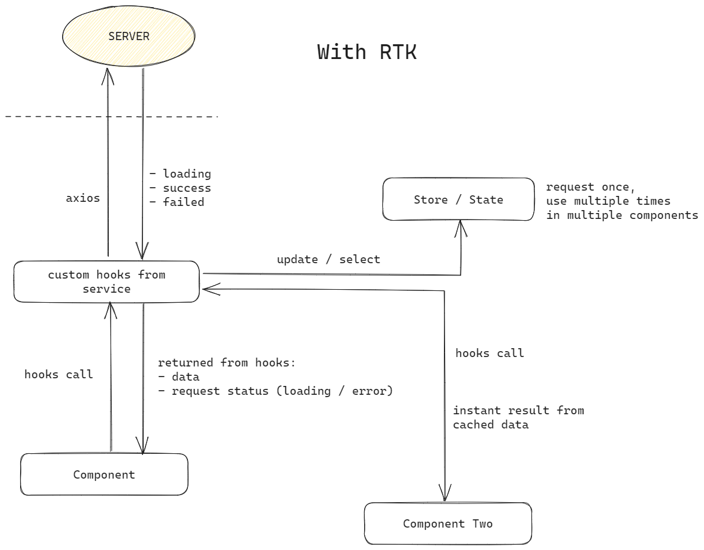
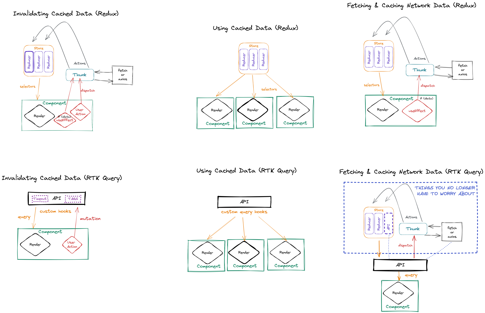
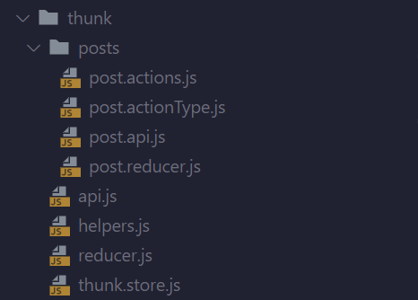
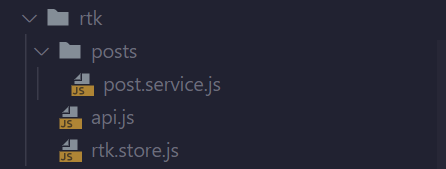

# RTK Query for Server State Management

## Data Flow Comparison

  


###

## Other Comparison



### What's wrong with Redux + Thunk

- A lot of boilerplate code
- Designed for delayed or asynchronous action
- Need to manually retrieve data and request status from the store
- Manual refetching after user mutation
- Hard to get type safety right
- Overall larger code needed

### Why Redux + RTK

- Simpler setup
- Designed and built for async state management
- Request status included with data from custom hooks
- Auto revalidation on user mutation
- Easier type safety
- Overall larger code needed

### Results

- **Code size and file needed:**
  - Before  
    
  - After  
    
- **Getting data and req status from component:**

  - Before

  ```javascript
  const loadingSelector = createLoadingSelector([POST_TYPE]);
  const errorSelector = createErrorMessageSelector([POST_TYPE]);

  const mapStateToProps = (state) => ({
  	...state,
  	error: errorSelector(state),
  	isLoading: loadingSelector(state),
  });

  const mapDispatchToProps = (dispatch) => ({
  	getAllPosts: () => getAllPosts()(dispatch),
  });

  export const ThunkDemo = connect(
  	mapStateToProps,
  	mapDispatchToProps
  )(function ThunkScreen(props) {
  	useEffect(() => {
  		props.getAllPosts();
  	}, []);

  	const { posts: data, isLoading, isError } = props.post;

  	console.log("Thunk:", { isLoading, isError, data });

  	return (
  		<View style={styles.container}>
  			<Text style={styles.header}>Thunk Implementation</Text>
  			{isLoading ? <Loading /> : null}
  			{data && data.length > 0 ? <PostList data={data} /> : null}
  			<StatusBar style="auto" />
  		</View>
  	);
  });

  export default function ThunkScreen() {
  	return (
  		<Provider store={storeConfig()}>
  			<ThunkDemo />
  		</Provider>
  	);
  }
  ```

  - After

  ```javascript
  function RTKDemo() {
  	const { data, isLoading, isError } = useGetAllPostQuery();

  	console.log("RTK:", { isLoading, isError, data });

  	return (
  		<View style={styles.container}>
  			<Text style={styles.header}>RTK Implementation</Text>
  			{isLoading ? <Loading /> : null}
  			{data && data.length > 0 ? <PostList data={data} /> : null}
  			<StatusBar style="auto" />
  		</View>
  	);
  }

  export default function RTKScreen() {
  	return (
  		<Provider store={store}>
  			<RTKDemo />
  		</Provider>
  	);
  }
  ```

### Reference:

- RTK Query Docs: [https://redux-toolkit.js.org/rtk-query/overview](https://redux-toolkit.js.org/rtk-query/overview)
- Understand the RTK Query Mental Model Compared to Redux Thunks: [https://egghead.io/lessons/redux-understand-the-rtk-query-mental-model-compared-to-redux-thunks](https://egghead.io/lessons/redux-understand-the-rtk-query-mental-model-compared-to-redux-thunks)
